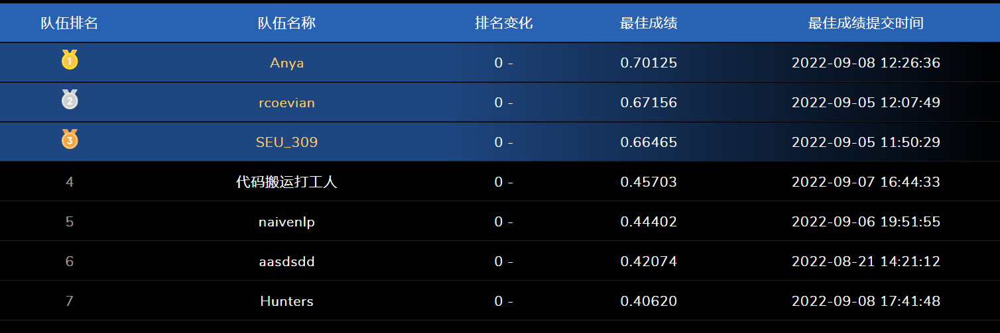
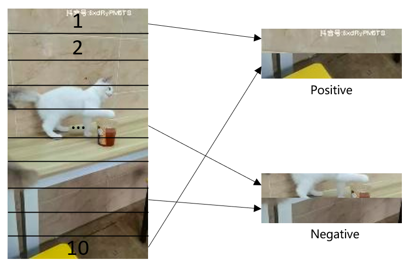

# 字节跳动安全AI挑战赛低分辨率抖音号识别赛道总结

这次比赛最终成绩为0.66465, 排名第三, 虽然和第一0.70125还有一定差距, 但大体还是很满意的. (主要归功于比赛内容和以前的经历相关)

## 任务分析

赛题内容可参见[比赛官网](https://security.bytedance.com/fe/2022/ai-challenge#/challenge). 简单说, 就是对视频截图中的抖音号进行识别, 并且测试集的分辨率低于训练集. 没拿到数据前, 我以为这个比赛主要是一个domain adaptation问题, 如何去消除训练集和测试集的domain shift. 但其实比赛的重点在于如何定位抖音号位置, 一般来说OCR需要先进行目标检测, 再进行识别, 而比赛并没有提供标注框, 也不能使用预训练模型, 如何采取合适的方法裁剪出抖音号所在区域对于下一阶段的文本识别影响很大. 

 

## 定位方案

### 直接裁剪

这个方案很粗暴. 浏览数据集我们可以发现, 抖音号绝大部分出现在图片的上边或下边, 所以我们可以直接裁剪出上下边并拼接在一起. 这里我选取的是上边1/10和下边1/10, 这个界限可以囊括绝大部分抖音号.

虽然抖音号仍然只占了裁剪后图片的一小部分, 但是相比原来无用信息已经少了很多了, 这个时候直接使用OCR模型训练已经可以取得不错的结果了. 考虑到这个背景无用信息较多, 所以当时采用的是attention机制SAR模型, 在测试集结果是0.18.

当然, 我们希望可以更准确的定位抖音号位置.

### 传统文本定位方法

既然不能使用预训练深度学习模型, 那就用传统方法呗. 我第一天就尝试了Maximally Stable Extremal Regions (MSER)等传统算法, 效果并不好, 文字也很难定位准确. 我没有在这个方向上做过多尝试, 当然我相信结合比赛数据调整传统算法/手写规则也可以在本任务中很好的做到抖音号定位.

### 更精细定位位置

#### Attention map定位左右

之前提到, 我们采用attention机制的SAR模型已经可以进行不错的文字识别了, 自然就想到我们可以将其attention可视化, 通过热图去做定位. 不过效果也不是很好, attention map无法精确的对准字符, 我自己猜想是SAR是对feature map做的attention, feature map和原图并不是完全对应的. 

就比如在该任务中的attention map的峰值始终在图像中间部分, 导致我们无法通过attention map区分抖音号在上边还是下边. 不过, 基于attention map我们还是可以区分出抖音号是位于图片左边还是右边的.

#### 人工构建数据集训练分类模型定位上下

对于区分在上边还是下边, 我们可以人为构建一个数据集训练一个是否存在抖音号的分类模型, 如图我们将原图10等分, 为了描述, 我们将其由上到下命名为1-10, 其中1和10组合为有抖音号的正样本, 随机选取2-9中的两个拼接构成负样本.

预测时, 将2-9中任选一个分别与1, 10拼接, 通过模型对其分别进行预测, 若1所在图片得分高, 则抖音号在图片上边, 若10所在图片得分高, 则抖音号在图片下边.

#### 小结

这个方案最后没有做下去, 因为这个方案的构思让我想到了更好的解决办法, 即弱监督目标定位. 

### 弱监督目标定位

做attention map定位觉得这个过程很像弱监督目标定位, 而上述训练分类模型中我们引入的人造标注就是个很好的弱监督信号. 所以我基于上述的分类模型, 使用了以前用过的DDT方法完成弱监督目标定位.

整个效果还是不错的

这里其实还有提升空间, 比如Rethinking the Route Towards Weakly Supervised Object Localization (PSOL) 中利用DDT生成的伪标签重新训练网络定位, 我也尝试了, 肉眼效果区别不大, 精力有限没有继续做实验比较结果.

我这里尝试过对于弱监督目标定位后的图片用人工规则进一步裁剪, 但是最终文本识别效果下降, 原因不明.

## 文本识别方案

文本识别算法可以看我之前的总结: https://zhuanlan.zhihu.com/p/540347287, 前面提到的SAR模型也有介绍. 

在经过弱监督目标定位后的图片上, 我主要尝试的是当前SOTA的SVTR模型 (SAR跑了一次效果一般就没有再调了).

训练500个epoch实验结果如下:

| 方法                                                         | 测试集准确度 |
| ------------------------------------------------------------ | ------------ |
| SVTR-Tiny                                                    | 0.484        |
| SVTR-Tiny + 常规增强                                         | 0.568        |
| SVTR-Tiny + 常规增强 + Text-Image-Augmentation               | 0.606        |
| SVTR-Tiny + 常规增强 + Text-Image-Augmentation + Pseudo Label | 0.618        |
| SVTR-Large + 常规增强 + Text-Image-Augmentation              | 0.620        |
| SVTR-Large + 常规增强 + Text-Image-Augmentation + Pseudo Label | 0.626        |
| SVTR-Large (removing STN) + 常规增强 + Text-Image-Augmentation | 0.646        |

常规增强: 裁剪, 模糊 (作用很大, 减少了训练集和测试集的domain shift), 色彩变换等. 开始没用增强是因为发现一使用增强模型无法训练, 后来排查发现是由于图像分辨率很低, 高斯模糊时5×5的高斯核太大, 会完全模糊图像, 故无法训练, 改为3×3后才正常.

Text-Image-Augmentation: 主要是下述三种变化, 是针对文本识别的图像增强手段.

Pseudo Label: 将测试集置信度大于一定阈值的标签作为伪标签, 重新训练模型.

SVTR-Large: 以前的话还会担心大模型过拟合, 但是两个月看到https://www.zhihu.com/question/356398589, 似乎大模型一般可以泛化的更好, 结果也是如此.

removing STN: STN本身不应该对于性能有影响, 这里移去STN主要是发现默认尺寸不适合, 且考虑到该任务文本比较规则, 所以移去.

由于最后几天服务器宕机了, 没有来得及将Pseudo Label和SVTR-Large (removing STN) 结合, 模型集成也只有0.646一个SVTR-Large (removing STN) 模型, 其他都是原来0.625左右的SVTR-Large模型, 最后投票结果即为最终成绩0.66465.

## 可能的提升空间

1. 多个结合Pseudo Label的SVTR-Large (removing STN) 集成. 这个应该可以有1-2个点的提升.
2. SOTA的弱监督目标定位. DDT是比较老的算法了, 本来是打算用PSOL的, DDT是PSOL算法的第一步, 但是发现效果不错, 就没有继续用别的了. 这里提升未知, 不一定有效果.
3. Domain adaptation. 这个作用可能不是很大, 因为数据增强中的模糊也可以类似的效果, 整体看这题的domain  shift并不严重, 最后在验证集上的准确率0.75和测试集0.646差距不大.
4. 调参. 这个影响应该比较大, SVTR模型可调的参数比较多的而且实验下来影响较大, 没有机会细调.
5. RotNet自监督预训练. 这个根据论文[What if we only use real datasets for scene text recognition? toward scene text recognition with fewer labels](http://openaccess.thecvf.com/content/CVPR2021/html/Baek_What_if_We_Only_Use_Real_Datasets_for_Scene_Text_CVPR_2021_paper.html)甚至好于MoCo.

## 相关代码

比赛代码: https://github.com/eshoyuan/Tiktok_OCR

文本识别参考代码: https://github.com/PaddlePaddle/PaddleOCR

弱监督目标定位参考代码: https://github.com/tzzcl/PSOL
