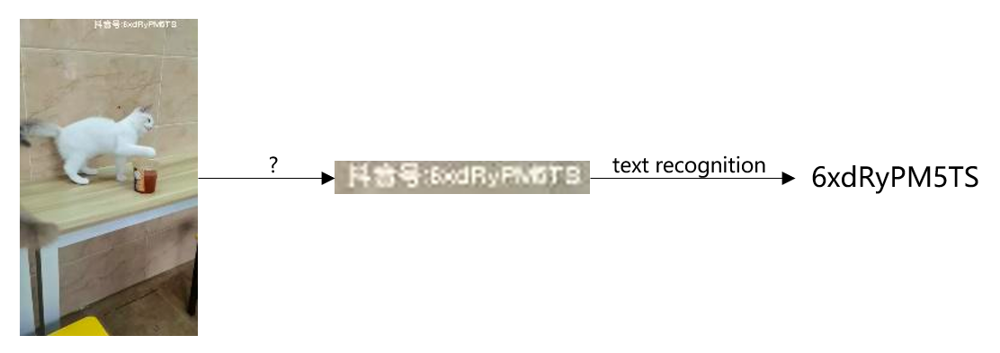
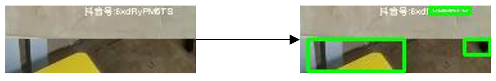
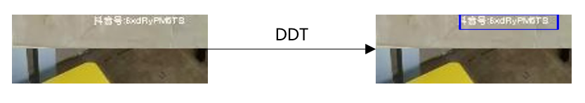

# TikTok Security AI Challenge: Low-Resolution TikTok ID Recognition Summary

## Task Analysis

The contest details can be seen on the [official website](https://security.bytedance.com/fe/2022/ai-challenge#/challenge). Simply put, it involves identifying TikTok accounts from video screenshots, where the resolution of the test set is lower than that of the training set. Before accessing the data, I assumed the competition mainly revolved around a domain adaptation problem, specifically how to eliminate the domain shift between the training and test sets. However, the competition's focus is actually on how to locate the position of the TikTok account. Generally, OCR requires target detection before recognition, but the competition did not provide any bounding boxes, nor could pre-trained models be used. Deciding on an appropriate method to crop the area containing the TikTok account has a significant impact on the subsequent text recognition phase.

 

## Location Scheme

### Direct Cropping

This approach is quite brute force. Scanning through the dataset, we can find that TikTok accounts appear mostly at the top or bottom of the image, so we can directly crop these areas and stitch them together. Here, I chose the top 1/10 and the bottom 1/10 of the image, which encompasses the majority of TikTok accounts.

Although the TikTok account still only occupies a small portion of the cropped image, compared to the original, there is significantly less irrelevant information. At this point, training directly with an OCR model can already achieve decent results. Considering the background contains a lot of irrelevant information, the attention mechanism SAR model was used at the time, resulting in a test set accuracy of 0.18.

Of course, we hope to locate the position of the TikTok account more accurately.

### Traditional Text Location Methods

Since we couldn't use pre-trained deep learning models, why not use traditional methods? On the first day, I tried traditional algorithms like Maximally Stable Extremal Regions (MSER), which did not perform well, and it was difficult to accurately locate text. I did not pursue this direction further, although I believe that adjusting traditional algorithms/hand-written rules in combination with competition data could effectively locate TikTok accounts.

### More Precise Location

#### Attention Map to Locate Left and Right

As mentioned before, we used the attention mechanism SAR model, which can perform decent text recognition. Naturally, we thought about visualizing its attention to use for location. However, the results were not very good; the attention map could not accurately align with characters. I speculate this is because SAR performs attention on the feature map, which does not correspond exactly to the original image.

For example, in this task, the peak values of the attention map are always in the middle part of the image, preventing us from using the attention map to differentiate whether the TikTok account is on the top or bottom. However, based on the attention map, we can still distinguish whether the TikTok account is located on the left or right side of the image.

#### Manually Constructed Dataset to Train Classification Model for Top/Bottom Location

To differentiate between the top and bottom, we can manually construct a dataset to train a classification model indicating the presence of a TikTok account. As shown, we divide the original image into 10 equal parts, named 1-10 from top to bottom, with combinations of 1 and 10 as positive samples for having a TikTok account, and randomly selecting two from 2-9 to stitch together as negative samples.

For prediction, select any one from 2-9 to stitch with 1 and 10, respectively, and predict using the model. If the image with 1 scores higher, then the TikTok account is on the top; if the image with 10 scores higher, then it is on the bottom.

#### Summary

This plan was not continued because it led me to a better solution, namely weakly supervised target location.

### Weakly Supervised Target Location

The process of doing attention map location felt very similar to weakly supervised target location. The artificial annotations we introduced in the training classification model above are a good weak supervision signal. Based on the classification model mentioned above, I used the DDT method I had used before to complete weakly supervised target location.

The overall effect is quite good.

There is actually room for improvement here, such as retraining the network for localization using pseudo labels generated by DDT as suggested in "Rethinking the Route Towards Weakly Supervised Object Localization (PSOL)." I tried this, and there wasn't a significant visible difference, so I didn't continue experimenting due to limited resources.

I also experimented with further cropping the images post weakly supervised object localization using manual rules, but this led to a decrease in text recognition performance for reasons unknown.

## Text Recognition Approach

For text recognition algorithms, see my previous summary: https://zhuanlan.zhihu.com/p/540347287, which also introduces the SAR model.

On images after weakly supervised object localization, my main experiment was with the current SOTA SVTR model (I ran the SAR model once but did not adjust it further due to mediocre performance).

The results after training for 500 epochs are as follows:

| Method                                                       | Test Set Accuracy |
| ------------------------------------------------------------ | ----------------- |
| SVTR-Tiny                                                    | 0.484             |
| SVTR-Tiny + Standard Augmentation                            | 0.568             |
| SVTR-Tiny + Standard Augmentation + Text-Image-Augmentation  | 0.606             |
| SVTR-Tiny + Standard Augmentation + Text-Image-Augmentation + Pseudo Label | 0.618             |
| SVTR-Large + Standard Augmentation + Text-Image-Augmentation | 0.620             |
| SVTR-Large + Standard Augmentation + Text-Image-Augmentation + Pseudo Label | 0.626             |
| SVTR-Large (removing STN) + Standard Augmentation + Text-Image-Augmentation | 0.646             |

Standard Augmentation: Cropping, blurring (significant effect, reducing domain shift between training and test sets), color changes, etc. Initially, augmentation was not used because it was found that using augmentation prevented the model from training. This issue was later identified to be due to the very low resolution of the images, where a 5×5 Gaussian kernel for Gaussian blur was too large, completely blurring the image, thus preventing training. Switching to a 3×3 kernel resolved the issue.

Text-Image-Augmentation: Mainly the following three types of changes, aimed at image enhancement for text recognition.

Pseudo Label: Using labels from the test set with confidence above a certain threshold as pseudo labels for retraining the model.

SVTR-Large: Previously, there were concerns about large models overfitting, but as seen in https://www.zhihu.com/question/356398589 over the past two months, it seems large models generally generalize better, which was also the case here.

Removing STN: STN itself should not impact performance. The removal of STN was mainly because the default size was not suitable, and considering the task involves relatively regular text, so it was removed.

Due to a server crash in the last few days, I did not manage to combine Pseudo Label and SVTR-Large (removing STN). Model integration consisted only of a single SVTR-Large (removing STN) model with 0.646 accuracy, with others being the original SVTR-Large models around 0.625. The final ensemble result was 0.66465.

## Potential Areas for Improvement

1. Multiple integrations of SVTR-Large (removing STN) with Pseudo Label. This could potentially improve by 1-2 percentage points.
2. State-of-the-art weakly supervised object localization. DDT is quite an old algorithm. Initially, I planned to use PSOL, where DDT is the first step, but since the results were good, I did not proceed with others. The effectiveness of this improvement is uncertain.
3. Domain adaptation. This might not be very significant since the blurring in data augmentation could achieve a similar effect. Overall, the domain shift in this challenge doesn't seem severe, with a 0.75 accuracy on the validation set and 0.646 on the test set indicating a small gap.
4. Parameter tuning. This could have a significant impact since the SVTR model has many parameters that greatly affect performance, but there was no opportunity for fine-tuning.
5. RotNet self-supervised pre-training. According to the paper [What if we only use real datasets for scene text recognition? toward scene text recognition with fewer labels](http://openaccess.thecvf.com/content/CVPR2021/html/Baek_What_if_We_Only_Use_Real_Datasets_for_Scene_Text_CVPR_2021_paper.html), this could even outperform MoCo.

## Related Code

Competition code: https://github.com/eshoyuan/Tiktok_OCR

Text recognition reference code: https://github.com/PaddlePaddle/PaddleOCR

Weakly supervised object localization reference code: https://github.com/tzzcl/PSOL
